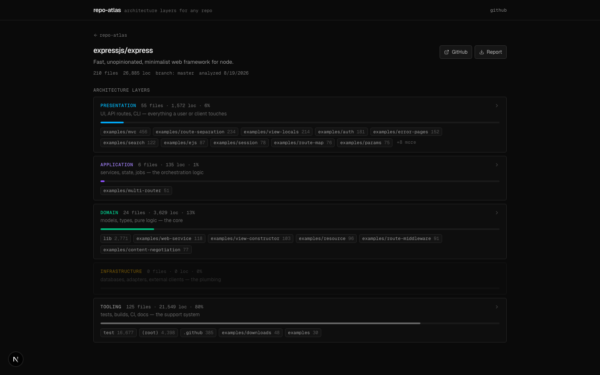
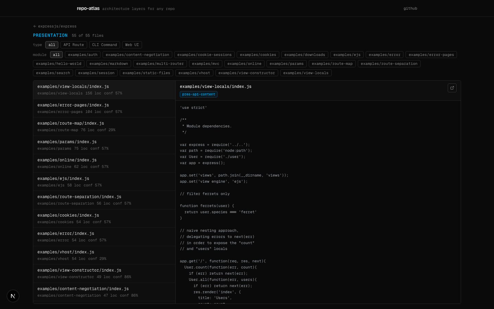

# Repo Atlas

**Live demo: [repo-atlas-tayden.vercel.app](https://repo-atlas-tayden.vercel.app)**

Paste a public GitHub repo, get its architecture: every file classified into five layers — presentation, application, domain, infrastructure, tooling — with per-layer drill-down, a read-only source viewer, and a Markdown report export.



## How classification works

No LLM involved — a scored rule engine ([`src/lib/analysis/classifier.ts`](src/lib/analysis/classifier.ts)) evaluates ~40 weighted rules against each file's **path** (`/services/`, `page.tsx`, `Dockerfile`), **extension** (`.tsx`, `.sql`, `.tf`), and **content** (a 50-line snippet checked for signatures like `createSlice`, `@Controller`, `describe(`). The highest-scoring layer wins; the score becomes a confidence value, and every matched rule is stored as a signal you can inspect per file in the UI.

| Layer | What lands there |
|---|---|
| `PRESENTATION` | UI components, API routes, CLI commands |
| `APPLICATION` | services, state management, jobs/workers |
| `DOMAIN` | models, types, pure utilities, config constants |
| `INFRASTRUCTURE` | database access, adapters, external clients |
| `TOOLING` | tests, build config, CI, docs |

Files also get grouped into inferred modules (with passthrough roots like `src/` and `lib/` skipped), so the layer stack reads as `agents/application · 456 loc` rather than a flat file list.



## The fetch path

An analysis costs **two GitHub API requests** regardless of repo size: one for metadata, one for the tarball. The archive is gunzipped and walked as raw ustar blocks in memory (~40 lines, no tar dependency), which keeps it inside serverless time limits and makes the unauthenticated rate limit a non-issue. Earlier versions fetched files one API call each — that approach is in the git history as a cautionary tale.

Guardrails: 2,000 files max per analysis, 200KB per file, 80MB per archive, binary content skipped. Re-analyzing a URL replaces the previous run instead of stacking duplicates.

## Running it

```bash
npm install
npx prisma db push     # creates the local SQLite db
npm run dev
```

| Env var | Purpose |
|---|---|
| `DATABASE_URL` | `file:./dev.db` locally; a `libsql://` Turso URL in production |
| `DATABASE_AUTH_TOKEN` | Turso auth token (production only) |
| `GITHUB_TOKEN` | optional — raises the GitHub API rate limit |

## Stack

Next.js (App Router) · TypeScript · Prisma on SQLite/Turso (libSQL) · Tailwind. Deploys on Vercel.
